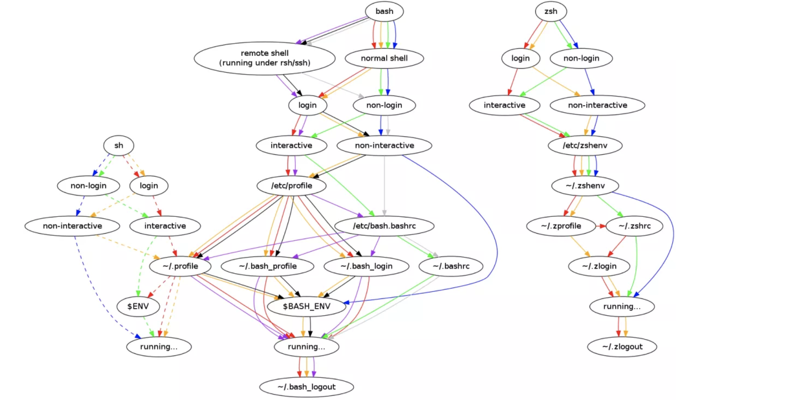

# bash

1. Here Docs and Here Strings - define a closing word, and the lines between that word and when it appears alone on a line become a file.

```bash
$ cat > afile << SOMEENDSTRING
> here is a doc
> it has three lines
> SOMEENDSTRING alone on a line will save the doc
> SOMEENDSTRING
```

2. String Variable Manipulation
* ${VAR#HEADER} - match and remove the following pattern from the start of the string 
* ${PASS%FOOTER} - match and remove the following pattern from the end of the string

3. Traps - builtin can be used to catch when a signal is sent to your script.
* trap cleanup TERM INT QUIT

4. List all shell variables
* bash - set -o posix ; set
* zsh - typeset

5. Some intresting variables
* random: ${RANDOM}
* seconds: ${SECONDS}
* linenumber: ${LINENO}

6. Sets
* set -e - exits from a script if any command returned a non-zero exit code
* set -x - outputs the commands that get run as they run:

7. <()
* the output is treated as a file - diff <(grep somestring file1) <(grep somestring file2)

8. Shortcuts
* `!$` - It repeats the last argument of the last command
* `!*` - repeats all argument
* `!:1-3` - repeats specific arguments ( use $ to ref till end§)

9. Startup Order
* open /Users/odedpriva/cheatsheets/images/login-process.png


## external links

* [https://devhints.io/bash](https://devhints.io/bash)

* [ten-more-things-i-wish-id-known-about-bash](https://zwischenzugs.com/2018/01/21/ten-more-things-i-wish-id-known-about-bash/)

* 
